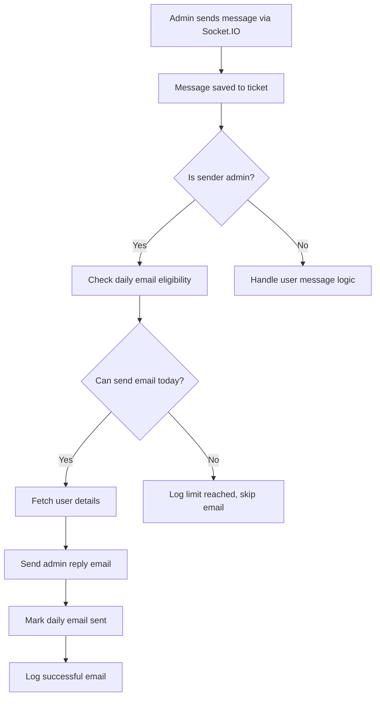
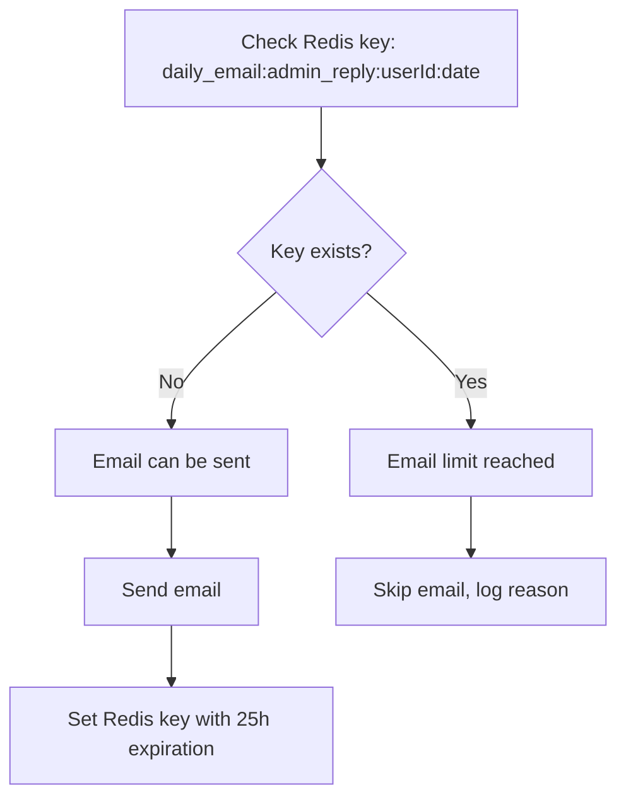

# Daily Email Notification System for Admin Chat Replies

## Overview
This document outlines the implementation of a daily email notification system that sends email notifications to users when admins reply to their chat messages, with a limit of one email per day per user to prevent spam.

## Features Implemented

### ✅ Core Features
1. **Daily Email Limit**: Users receive at most one email notification per day when admins reply to their chat
2. **Redis-based Tracking**: Uses Redis to track daily email sending status with automatic expiration
3. **Graceful Fallbacks**: If Redis is unavailable, emails are still sent to ensure no missed notifications
4. **Professional Email Template**: Custom HTML email template for admin reply notifications
5. **Admin Management APIs**: APIs for checking and resetting email limits
6. **Real-time Integration**: Seamlessly integrated with existing Socket.IO chat system

### 🔧 Technical Implementation

#### 1. Email Template (`supportEmailTemplates.js`)
- **Function**: `sendAdminReplyNotificationEmail(userEmail, ticket, adminReply)`
- **Features**:
  - Professional HTML email with branding
  - Shows admin name, timestamp, and message content
  - Direct link to continue chat
  - Clear explanation of daily email limit policy

#### 2. Daily Email Tracker (`dailyEmailTracker.js`)
- **Key Functions**:
  - `canSendDailyEmail(userId, emailType)`: Check if email can be sent today
  - `markDailyEmailSent(userId, emailType)`: Mark email as sent for today
  - `getDailyEmailStatus(userId, emailType)`: Get detailed status for debugging
  - `resetDailyEmailLimit(userId, emailType)`: Reset limit (admin function)

- **Redis Key Format**: `daily_email:{emailType}:{userId}:{YYYY-MM-DD}`
- **Expiration**: 25 hours (handles timezone differences)

#### 3. Chat Service Integration (`chatSocketService.js`)
Enhanced the `send_message` socket event handler to:
1. Check if the sender is an admin
2. Verify daily email eligibility
3. Fetch user details and send email if eligible
4. Mark email as sent and log the action
5. Provide detailed logging for debugging

#### 4. Admin Management APIs (`adminEmailTracking.routes.js`)
- **GET** `/api/admin/email-tracking/status/:userId`: Get email status
- **GET** `/api/admin/email-tracking/check/:userId`: Check if email can be sent
- **POST** `/api/admin/email-tracking/reset/:userId`: Reset daily limit

## Step-by-Step Implementation Flow

### 1. Admin Sends Chat Message


### 2. Daily Email Tracking Logic


### 3. Error Handling & Fallbacks
- **Redis Unavailable**: Allow emails to prevent missed notifications
- **User Not Found**: Log warning and skip email
- **Email Service Error**: Log error but don't fail socket operation
- **Invalid Email**: Skip email, log issue

## Configuration & Environment

### Required Environment Variables
```env
# Email service (already configured)
BREVO_API_KEY=your_brevo_api_key
EMAIL_USER=your_gmail_user
EMAIL_PASS=your_gmail_app_password

# Redis (already configured)
REDIS_HOST=your_redis_host
REDIS_PORT=6379
REDIS_PASSWORD=your_redis_password

# Frontend URL for email links
FRONTEND_URL=https://mydeeptech.ng
```

### Database Dependencies
- **MongoDB**: Stores tickets and user data
- **Redis**: Tracks daily email limits
- **Email Service**: Brevo SMTP or Gmail (already configured)

## Usage Examples

### For Developers
```javascript
// Check if email can be sent
const canSend = await canSendDailyEmail('user123', 'admin_reply');

// Send email and mark as sent
if (canSend) {
  await sendAdminReplyNotificationEmail(user.email, ticket, adminReply);
  await markDailyEmailSent('user123', 'admin_reply');
}

// Get detailed status
const status = await getDailyEmailStatus('user123', 'admin_reply');
console.log(status); // { canSend: false, lastSent: '2026-01-28T10:30:00Z', expiresIn: 72000 }
```

### For Admins (API Endpoints)
```bash
# Check email status for user
GET /api/admin/email-tracking/status/user123?emailType=admin_reply

# Reset daily limit for user
POST /api/admin/email-tracking/reset/user123
Content-Type: application/json
{ "emailType": "admin_reply" }

# Check if email can be sent
GET /api/admin/email-tracking/check/user123?emailType=admin_reply
```

## User Experience

### What Users See
1. **First Admin Reply of the Day**: User receives email notification with:
   - Professional email template
   - Admin name and reply content  
   - Direct link to continue chat
   - Clear policy explanation

2. **Subsequent Admin Replies**: 
   - No additional emails sent
   - Real-time notifications in app continue normally
   - Users can still access chat directly

### Email Content Preview
```
Subject: 💬 Support Reply - TKT-1737984800000-12345678

Good news! Our support team has replied to your chat for ticket TKT-1737984800000-12345678.

Latest Response:
From: John Smith (Support Team)
Time: 1/28/2026, 3:45:00 PM
Message: "Hi there! I'd be happy to help you with this issue..."

[Continue Chat Button]

💡 Tip: You'll receive email updates when you receive new messages, but only once per day to avoid spam.
```

## Monitoring & Debugging

### Logs to Watch For
```bash
# Successful email sent
📧 Daily admin reply email sent to user@example.com for ticket TKT-123

# Daily limit reached
📧 Daily email limit reached for user 12345. Last sent: 2026-01-28T10:30:00Z, expires in: 72000s

# Redis unavailable fallback
⚠️ Redis not available, allowing email to prevent missing notifications

# Email service error
❌ Error sending admin reply email: SMTP connection failed
```

### Redis Key Monitoring
```bash
# View all daily email keys
redis-cli KEYS "daily_email:*"

# Check specific user's email status
redis-cli GET "daily_email:admin_reply:user123:2026-01-28"

# View key expiration
redis-cli TTL "daily_email:admin_reply:user123:2026-01-28"
```

## Performance Considerations

### Scalability
- **Redis Memory Usage**: ~100 bytes per user per day
- **Email Rate Limits**: Respects Brevo/Gmail daily limits
- **Database Impact**: Minimal (2 additional queries per admin reply)

### Optimization
- Keys auto-expire to prevent Redis bloat
- Graceful fallbacks prevent service disruption
- Efficient Redis operations (GET/SET with TTL)

## Security Considerations

1. **Admin Authentication**: All management endpoints require admin authentication
2. **User Privacy**: Email addresses are not exposed in logs
3. **Rate Limiting**: Built-in daily limits prevent email abuse
4. **Secure Redis**: Uses authentication and encrypted connections

## Future Enhancements

### Potential Improvements
1. **Email Preferences**: Allow users to configure notification frequency
2. **Multiple Email Types**: Different limits for different notification types
3. **Analytics Dashboard**: Track email delivery rates and user engagement
4. **A/B Testing**: Test different email templates and timing
5. **Push Notifications**: Alternative to email for mobile users

### Extension Points
```javascript
// Support for different email types
await canSendDailyEmail(userId, 'ticket_update');
await canSendDailyEmail(userId, 'project_notification');

// Custom frequency limits
await canSendWeeklyEmail(userId, 'newsletter');
await canSendHourlyEmail(userId, 'urgent_alerts');
```

## Testing

### Manual Testing
1. **Admin sends chat message** → User should receive email (first time today)
2. **Admin sends another message** → No additional email sent
3. **Next day admin sends message** → User receives new email
4. **Redis disabled** → Emails still sent (fallback)
5. **User has no email** → Gracefully skipped with log

### API Testing
```bash
# Test admin endpoints
curl -X GET "http://localhost:5000/api/admin/email-tracking/status/user123" \
  -H "Authorization: Bearer admin_token"

curl -X POST "http://localhost:5000/api/admin/email-tracking/reset/user123" \
  -H "Authorization: Bearer admin_token" \
  -H "Content-Type: application/json" \
  -d '{"emailType": "admin_reply"}'
```

## Troubleshooting

### Common Issues
1. **Emails not sending**: Check Redis connection and email service credentials
2. **Multiple emails per day**: Verify Redis key format and expiration
3. **Admin APIs failing**: Ensure admin authentication middleware is working
4. **Template rendering issues**: Check HTML email content and variables

### Debug Commands
```javascript
// Check Redis connection
const client = await getRedisClient();
console.log('Redis connected:', client.connected);

// Test email functionality
const result = await sendAdminReplyNotificationEmail(email, ticket, reply);
console.log('Email result:', result);

// View email status
const status = await getDailyEmailStatus(userId, 'admin_reply');
console.log('Email status:', status);
```

---

This implementation provides a robust, scalable solution for daily email notifications with proper fallbacks, monitoring, and admin management capabilities.