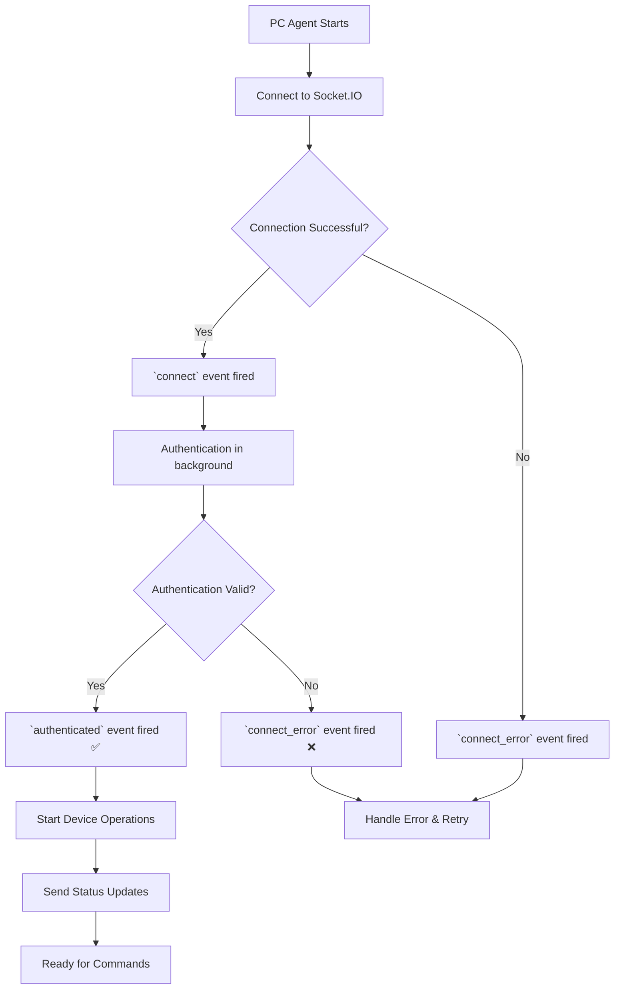

# PC Agent WebSocket API Documentation

> **Version:** 2.0  
> **Last Updated:** March 13, 2026  
> **Environment:** Production & Development

## 📡 **WebSocket Connection**

### **Connection URL**
```javascript
// ✅ CORRECT: Connect to domain with namespace
const socket = io('wss://mydeeptech-be.onrender.com/hvnc-device', {
  auth: { token: deviceAuthToken },
  transports: ['websocket', 'polling']
});

// This will:
// 1. Connect to Socket.IO engine: /socket.io 
// 2. Join HVNC device namespace: /hvnc-device
```

### **Connection Flow:**
```
PC Agent → wss://mydeeptech-be.onrender.com/hvnc-device
         ↓
1. Socket.IO Engine: GET /socket.io?EIO=4&transport=polling ✅
2. Join Namespace: /hvnc-device ✅  
3. Authentication: JWT device token ✅
```

### **Environment Variables**
```bash
# Production
HVNC_SERVER_URL=wss://mydeeptech-be.onrender.com

# Development  
HVNC_SERVER_URL=ws://localhost:4000
```

### **Connection Parameters**
- **Namespace:** `/hvnc-device`
- **Authentication:** JWT Token (from device registration)
- **Transports:** WebSocket (primary), Polling (fallback)
- **Path:** Uses default Socket.IO path `/socket.io` (shared with chat system)

---

## 🔐 **Authentication**

### **1. Device Registration (Get Auth Token)**
```javascript
// First, register device to get authentication token
const registrationResponse = await fetch('https://mydeeptech-be.onrender.com/api/hvnc/devices/register', {
  method: 'POST',
  headers: { 'Content-Type': 'application/json' },
  body: JSON.stringify({
    device_id: 'HVNC_' + Date.now(),
    pc_name: 'USER-PC-01',
    hostname: 'USER-DESKTOP',
    operating_system: 'Windows 10',
    browser_version: 'Chrome 120.0.0.0',
    system_info: {
      cpu: 'Intel i7',
      memory_gb: 16,
      storage_gb: 512,
      screen_resolution: '1920x1080'
    }
  })
});

const { auth, device } = await registrationResponse.json();
const deviceAuthToken = auth.token; // Use for WebSocket connection
```

### **2. WebSocket Authentication**
```javascript
const socket = io('wss://mydeeptech-be.onrender.com/hvnc-device', {
  auth: { token: deviceAuthToken } // JWT token from registration
});
```

---

## 🔌 **Connection Lifecycle**

### **Connection Events**
```javascript
// 1. Basic connection established
socket.on('connect', () => {
  console.log('🔌 Connected to HVNC server');
  console.log('Socket ID:', socket.id);
  // At this point, authentication is happening in the background
});

// 2. Authentication successful ✅ 
socket.on('authenticated', (data) => {
  console.log('✅ Authentication successful!');
  console.log('Device ID:', data.deviceId);
  console.log('PC Name:', data.pcName);
  console.log('Message:', data.message);
  console.log('Timestamp:', data.timestamp);
  
  // Now the PC agent is ready to:
  // - Send status updates 
  // - Receive commands
  // - Send screen captures
  
  // Send initial device status
  socket.emit('device_status', {
    status: 'online',
    cpu_usage: 45.2,
    memory_usage: 67.8,
    disk_usage: 23.1,
    timestamp: new Date().toISOString()
  });
  
  console.log('📡 Device ready for remote control');
});

// 3. Connection failed ❌
socket.on('connect_error', (error) => {
  console.error('❌ Connection failed:', error.message);
  
  // Handle specific error types
  if (error.message.includes('Authentication failed')) {
    console.error('🔑 Check device token validity');
  } else if (error.message.includes('Device not found')) {
    console.error('🖥️ Device not registered in system');
  } else if (error.message.includes('Device is disabled')) {
    console.error('⛔ Device account disabled');
  }
});

// 4. Disconnection handling
socket.on('disconnect', (reason) => {
  console.log('🔌 Disconnected from HVNC server');
  console.log('Reason:', reason);
  
  if (reason === 'io server disconnect') {
    // Server disconnected the client (e.g., authentication revoked)
    console.log('🚫 Server force-disconnected this device');
  } else {
    // Client disconnected or network issue
    console.log('🔄 Attempting reconnection...');
  }
});
    uptime: process.uptime(),
    chrome_status: 'running',
    hubstaff_status: 'active',
    system_health: 'good'
  });
});

// Connection failed
socket.on('connect_error', (error) => {
  console.error('❌ Connection failed:', error.message);
  // Retry logic here
});

// Disconnected
socket.on('disconnect', (reason) => {
  console.log('🔌 Disconnected:', reason);
  // Handle reconnection
});
```

---

## � **Complete PC Agent Implementation**

### **Full Connection Flow Example**

```javascript
const io = require('socket.io-client');

class HVNCAgent {
  constructor(deviceToken) {
    this.deviceToken = deviceToken;
    this.socket = null;
    this.isAuthenticated = false;
    this.deviceId = null;
  }

  connect() {
    console.log('🚀 Starting HVNC Agent...');
    
    // Connect to HVNC server
    this.socket = io('wss://mydeeptech-be.onrender.com/hvnc-device', {
      auth: { token: this.deviceToken },
      transports: ['websocket', 'polling'],
      reconnection: true,
      reconnectionAttempts: 5,
      reconnectionDelay: 2000
    });

    this.setupEventHandlers();
  }

  setupEventHandlers() {
    // ✅ Connection successful
    this.socket.on('connect', () => {
      console.log('🔌 Connected to HVNC server');
      console.log('Socket ID:', this.socket.id);
      console.log('⏳ Waiting for authentication...');
    });

    // ✅ Authentication confirmed - THIS IS KEY!
    this.socket.on('authenticated', (data) => {
      console.log('🎉 AUTHENTICATION SUCCESSFUL!');
      console.log('━━━━━━━━━━━━━━━━━━━━━━━━━━━━━━━━━━━━━━━━');
      console.log(`📋 Device ID: ${data.deviceId}`);
      console.log(`🖥️  PC Name: ${data.pcName}`);
      console.log(`📅 Connected: ${data.timestamp}`);
      console.log(`✅ Status: ${data.message}`);
      console.log('━━━━━━━━━━━━━━━━━━━━━━━━━━━━━━━━━━━━━━━━');
      
      this.isAuthenticated = true;
      this.deviceId = data.deviceId;
      
      // Start device operations
      this.startDeviceOperations();
    });

    // ❌ Connection errors
    this.socket.on('connect_error', (error) => {
      console.error('❌ Connection failed:', error.message);
      this.handleConnectionError(error);
    });

    // 🔌 Disconnection
    this.socket.on('disconnect', (reason) => {
      console.warn('🔌 Disconnected:', reason);
      this.isAuthenticated = false;
      
      if (reason === 'io server disconnect') {
        console.warn('🚫 Server disconnected this device');
      }
    });
  }

  startDeviceOperations() {
    console.log('📡 Starting device operations...');
    
    // Send initial status
    this.sendDeviceStatus();
    
    // Start periodic status updates
    setInterval(() => {
      if (this.isAuthenticated) {
        this.sendDeviceStatus();
      }
    }, 30000);

    console.log('✅ PC Agent ready for remote control!');
  }

  sendDeviceStatus() {
    const status = {
      status: 'online',
      cpu_usage: this.getCpuUsage(),
      memory_usage: this.getMemoryUsage(), 
      disk_usage: this.getDiskUsage(),
      timestamp: new Date().toISOString()
    };

    this.socket.emit('device_status', status);
  }

  handleConnectionError(error) {
    if (error.message.includes('Authentication failed')) {
      console.error('🔑 Check device token validity');
    } else if (error.message.includes('Device not found')) {
      console.error('🖥️ Device not registered');
    } else if (error.message.includes('Device is disabled')) {
      console.error('⛔ Device account disabled');
    }
  }

  getCpuUsage() { return Math.floor(Math.random() * 100); }
  getMemoryUsage() { return Math.floor(Math.random() * 100); }
  getDiskUsage() { return Math.floor(Math.random() * 100); }
}

// Usage
const agent = new HVNCAgent('your-device-token-here');
agent.connect();
```

### **Connection Status Flow**



---

## �📤 **Outbound Events (PC Agent → Server)**

### **1. Device Status Updates**
```javascript
// Send device status every 30 seconds
setInterval(() => {
  socket.emit('device_status', {
    status: 'online',
    uptime: process.uptime(),
    chrome_status: 'running',
    hubstaff_status: 'active', 
    system_health: 'good',
    cpu_usage: 45.2,
    memory_usage: 62.1,
    timestamp: new Date().toISOString()
  });
}, 30000);
```

### **2. Heartbeat**
```javascript
// Send heartbeat every 60 seconds
setInterval(() => {
  socket.emit('heartbeat', {
    timestamp: new Date().toISOString(),
    uptime: process.uptime()
  });
}, 60000);
```

### **3. Command Response**
```javascript
// Respond to commands from admin/user
socket.on('command', async (commandData) => {
  const { id, action, parameters, session_id, type } = commandData;
  
  try {
    let result;
    
    // Handle Hubstaff commands
    if (type === 'hubstaff') {
      switch (action) {
        case 'hubstaff_start':
          result = await handleHubstaffStart(parameters);
          break;
        case 'hubstaff_pause':
          result = await handleHubstaffPause(parameters);
          break;
        case 'hubstaff_stop':
          result = await handleHubstaffStop(parameters);
          break;
        default:
          throw new Error(`Unknown Hubstaff command: ${action}`);
      }
    } else {
      // Handle other command types
      switch (action) {
        case 'screenshot':
          result = await takeScreenshot();
          break;
        case 'mouse_click':
          result = await simulateMouseClick(parameters.x, parameters.y);
          break;
        case 'keyboard_input':
          result = await simulateKeyboardInput(parameters.text);
          break;
        case 'open_application':
          result = await openApplication(parameters.app_path);
          break;
        default:
          throw new Error(`Unknown command: ${action}`);
      }
    }
    
    // Send success response
    socket.emit('command_response', {
      command_id: id,
      session_id: session_id,
      status: 'completed',
      result: result,
      timestamp: new Date().toISOString()
    });
    
  } catch (error) {
    // Send error response
    socket.emit('command_response', {
      command_id: id,
      session_id: session_id,
      status: 'failed',
      error: error.message,
      timestamp: new Date().toISOString()
    });
  }
});

// Example Hubstaff handlers
async function handleHubstaffStart(parameters) {
  const { projectId, taskName } = parameters || {};
  
  // Your implementation here:
  // - Start Hubstaff desktop application
  // - Begin time tracking
  // - Set project/task if provided
  
  console.log('🚀 Starting Hubstaff timer...');
  
  return {
    success: true,
    action: 'hubstaff_started',
    projectId,
    taskName,
    timestamp: new Date().toISOString()
  };
}

async function handleHubstaffPause(parameters) {
  // Your implementation here:
  // - Pause Hubstaff timer
  
  console.log('⏸️ Pausing Hubstaff timer...');
  
  return {
    success: true,
    action: 'hubstaff_paused',
    timestamp: new Date().toISOString()
  };
}
```

### **4. Session Events**
```javascript
// Acknowledge session start
socket.on('session_started', (sessionData) => {
  const { session_id, user_email, user_name } = sessionData;
  console.log(`🎮 Session started: ${user_name} (${user_email})`);
  
  // Acknowledge session start
  socket.emit('session_acknowledged', {
    session_id: session_id,
    device_ready: true,
    timestamp: new Date().toISOString()
  });
});

// Acknowledge session end
socket.on('session_ended', (sessionData) => {
  const { session_id, reason } = sessionData;
  console.log(`🛑 Session ended: ${session_id} (${reason})`);
  
  // Clean up session resources
  cleanupSession(session_id);
  
  socket.emit('session_cleanup_complete', {
    session_id: session_id,
    timestamp: new Date().toISOString()
  });
});
```

---

## 📥 **Inbound Events (Server → PC Agent)**

### **1. Commands from Admin/Users**
```javascript
socket.on('command', (commandData) => {
  /*
    commandData = {
      id: 'cmd_12345',
      type: 'control',
      action: 'screenshot', // screenshot, mouse_click, keyboard_input, etc.
      parameters: { x: 100, y: 50, text: 'hello' },
      session_id: 'session_67890',
      priority: 'high',
      timeout_seconds: 30
    }
  */
});
```

### **2. Session Management**
```javascript
socket.on('session_started', (sessionData) => {
  /*
    sessionData = {
      session_id: 'session_12345',
      user_email: 'user@example.com', 
      user_name: 'John Doe'
    }
  */
});

socket.on('session_ended', (sessionData) => {
  /*
    sessionData = {
      session_id: 'session_12345',
      reason: 'user_disconnected' // user_disconnected, admin_action, timeout
    }
  */
});
```

### **3. Configuration Updates**
```javascript
socket.on('config_update', (config) => {
  /*
    config = {
      heartbeat_interval: 60,
      max_session_duration: 480, // minutes
      allowed_commands: ['screenshot', 'mouse_click'],
      security_settings: { ... }
    }
  */
  console.log('📋 Configuration updated:', config);
});
```

---

## 🎯 **Command Actions**

### **Available Commands**
| Action | Parameters | Description |
|--------|------------|-------------|
| `screenshot` | None | Capture screen screenshot |
| `mouse_click` | `{x, y, button}` | Simulate mouse click |
| `mouse_move` | `{x, y}` | Move mouse cursor |
| `keyboard_input` | `{text}` | Type text |
| `key_press` | `{key, modifiers}` | Press specific keys |
| `open_application` | `{app_path, args}` | Launch application |
| `close_application` | `{process_name}` | Close application |
| `file_upload` | `{file_data, path}` | Upload file to device |
| `file_download` | `{file_path}` | Download file from device |
| `hubstaff_start` | `{projectId?, taskName?}` | **Start Hubstaff timer** |
| `hubstaff_pause` | None | **Pause Hubstaff timer** |
| `hubstaff_stop` | None | **Stop Hubstaff timer** |

### **Command Implementation Example**
```javascript
async function executeCommand(action, parameters) {
  switch (action) {
    case 'screenshot':
      const screenshot = require('screenshot-desktop');
      const imageBuffer = await screenshot();
      return {
        image: imageBuffer.toString('base64'),
        format: 'png',
        timestamp: new Date().toISOString()
      };
      
    case 'mouse_click':
      const robot = require('robotjs');
      robot.moveMouse(parameters.x, parameters.y);
      robot.mouseClick(parameters.button || 'left');
      return { success: true, position: { x: parameters.x, y: parameters.y } };
      
    case 'keyboard_input':
      const robot2 = require('robotjs');
      robot2.typeString(parameters.text);
      return { success: true, text: parameters.text };
      
    case 'open_application':
      const { spawn } = require('child_process');
      const process = spawn(parameters.app_path, parameters.args || []);
      return { success: true, pid: process.pid };
      
    default:
      throw new Error(`Unsupported command: ${action}`);
  }
}
```

---

## ⚠️ **Error Handling**

### **Connection Errors**
```javascript
socket.on('connect_error', (error) => {
  switch (error.message) {
    case 'Device authentication token required':
      console.error('❌ Missing auth token');
      // Request new token
      break;
    case 'Device authentication failed':
      console.error('❌ Invalid auth token');
      // Re-register device
      break;
    case 'Device is disabled':
      console.error('❌ Device disabled by admin');
      // Show admin contact info
      break;
    default:
      console.error('❌ Connection error:', error.message);
  }
});
```

### **Reconnection Logic**
```javascript
let reconnectAttempts = 0;
const maxReconnectAttempts = 5;

socket.on('disconnect', (reason) => {
  if (reason === 'io server disconnect') {
    // Server disconnected, don't reconnect automatically
    console.log('🚫 Server disconnected device');
    return;
  }
  
  // Implement exponential backoff
  const delay = Math.pow(2, reconnectAttempts) * 1000; // 1s, 2s, 4s, 8s, 16s
  
  if (reconnectAttempts < maxReconnectAttempts) {
    setTimeout(() => {
      console.log(`🔄 Reconnecting... (Attempt ${reconnectAttempts + 1})`);
      socket.connect();
      reconnectAttempts++;
    }, delay);
  }
});

socket.on('connect', () => {
  reconnectAttempts = 0; // Reset on successful connection
});
```

---

## 📊 **Status Monitoring**

### **Device Status Object**
```javascript
const deviceStatus = {
  status: 'online', // online, busy, offline
  uptime: process.uptime(),
  chrome_status: 'running', // running, stopped, error
  hubstaff_status: 'active', // active, inactive, not_installed
  system_health: 'good', // good, warning, critical
  cpu_usage: 45.2, // percentage
  memory_usage: 62.1, // percentage
  disk_space_gb: 128.5, // available space
  active_sessions: 1,
  last_activity: new Date().toISOString()
};
```

### **Health Check**
```javascript
// Send detailed health status every 5 minutes
setInterval(() => {
  socket.emit('health_check', {
    device_id: deviceId,
    timestamp: new Date().toISOString(),
    system_info: {
      os: require('os').platform(),
      arch: require('os').arch(),
      node_version: process.version,
      uptime: process.uptime(),
      memory: process.memoryUsage(),
      cpu_count: require('os').cpus().length
    },
    chrome_status: getChromeStatus(),
    hubstaff_status: getHubstaffStatus(),
    network_status: getNetworkStatus()
  });
}, 5 * 60 * 1000);
```

---

## 🚀 **Complete Example Implementation**

```javascript
const io = require('socket.io-client');
const robot = require('robotjs');
const screenshot = require('screenshot-desktop');

class HVNCAgent {
  constructor(deviceAuthToken) {
    this.deviceToken = deviceAuthToken;
    this.socket = null;
    this.activeSessions = new Set();
  }
  
  async connect() {
    this.socket = io('wss://mydeeptech-be.onrender.com/hvnc-device', {
      auth: { token: this.deviceToken },
      transports: ['websocket', 'polling']
    });
    
    this.setupEventHandlers();
  }
  
  setupEventHandlers() {
    // Connection events
    this.socket.on('connect', () => {
      console.log('✅ Connected to HVNC server');
      this.startHeartbeat();
      this.startStatusUpdates();
    });
    
    this.socket.on('connect_error', (error) => {
      console.error('❌ Connection failed:', error.message);
    });
    
    // Command handling
    this.socket.on('command', async (commandData) => {
      await this.handleCommand(commandData);
    });
    
    // Session events
    this.socket.on('session_started', (sessionData) => {
      this.activeSessions.add(sessionData.session_id);
      console.log(`🎮 Session started: ${sessionData.user_name}`);
    });
    
    this.socket.on('session_ended', (sessionData) => {
      this.activeSessions.delete(sessionData.session_id);
      console.log(`🛑 Session ended: ${sessionData.session_id}`);
    });
  }
  
  async handleCommand(commandData) {
    const { id, action, parameters, session_id } = commandData;
    
    try {
      let result;
      
      switch (action) {
        case 'screenshot':
          result = await this.takeScreenshot();
          break;
        case 'mouse_click':
          result = await this.simulateMouseClick(parameters);
          break;
        case 'keyboard_input':
          result = await this.simulateKeyboardInput(parameters);
          break;
        default:
          throw new Error(`Unknown command: ${action}`);
      }
      
      this.socket.emit('command_response', {
        command_id: id,
        session_id: session_id,
        status: 'completed',
        result: result,
        timestamp: new Date().toISOString()
      });
      
    } catch (error) {
      this.socket.emit('command_response', {
        command_id: id,
        session_id: session_id,
        status: 'failed',
        error: error.message,
        timestamp: new Date().toISOString()
      });
    }
  }
  
  async takeScreenshot() {
    const imageBuffer = await screenshot();
    return {
      image: imageBuffer.toString('base64'),
      format: 'png',
      width: robot.getScreenSize().width,
      height: robot.getScreenSize().height
    };
  }
  
  async simulateMouseClick(parameters) {
    const { x, y, button = 'left' } = parameters;
    robot.moveMouse(x, y);
    robot.mouseClick(button);
    return { success: true, position: { x, y }, button };
  }
  
  async simulateKeyboardInput(parameters) {
    robot.typeString(parameters.text);
    return { success: true, text: parameters.text };
  }
  
  startHeartbeat() {
    setInterval(() => {
      if (this.socket.connected) {
        this.socket.emit('heartbeat', {
          timestamp: new Date().toISOString(),
          uptime: process.uptime()
        });
      }
    }, 60000);
  }
  
  startStatusUpdates() {
    setInterval(() => {
      if (this.socket.connected) {
        this.socket.emit('device_status', {
          status: 'online',
          uptime: process.uptime(),
          chrome_status: 'running',
          hubstaff_status: 'active',
          active_sessions: this.activeSessions.size,
          timestamp: new Date().toISOString()
        });
      }
    }, 30000);
  }
}

// Usage
const agent = new HVNCAgent(deviceAuthToken);
agent.connect();
```

---

## 📝 **Testing & Debugging**

### **Test Connection**
```javascript
// Simple connection test
const testSocket = io('wss://mydeeptech-be.onrender.com/hvnc-device', {
  auth: { token: 'your_device_token_here' }
});

testSocket.on('connect', () => {
  console.log('✅ Test connection successful');
  testSocket.disconnect();
});

testSocket.on('connect_error', (error) => {
  console.error('❌ Test connection failed:', error.message);
});
```

### **Enable Debug Logging**
```javascript
// Enable Socket.IO debug logging
localStorage.debug = 'socket.io-client:socket';

// Or in Node.js
process.env.DEBUG = 'socket.io-client:socket';
```

## **13. Troubleshooting**

### **Connection Issues**

#### **Problem: 404 GET /socket.io**
```javascript
// ❌ Server not ready or initialization order issue
// ✅ Solution: Ensure server initialized MongoDB before WebSocket
```

#### **Problem: Authentication Failed**
```javascript
socket.on('connect_error', (error) => {
  if (error.message === 'Authentication failed') {
    console.error('Device token invalid or expired');
    // Re-authenticate with device management API
  }
});
```

#### **Problem: Namespace Connection Failed**
```javascript
socket.on('disconnect', (reason) => {
  console.log('Disconnected:', reason);
  if (reason === 'io server disconnect') {
    console.log('Server force-disconnected - check authentication');
  }
});
```

### **Test Connection**
```javascript
// Basic connection test
const socket = io('wss://mydeeptech-be.onrender.com/hvnc-device', {
  auth: { token: 'your-device-token' },
  transports: ['websocket', 'polling']
});

// Connection events
socket.on('connect', () => {
  console.log('✅ Connected to HVNC WebSocket');
  console.log('Socket ID:', socket.id);
});

socket.on('connect_error', (error) => {
  console.error('❌ Connection failed:', error.message);
});

socket.on('authenticated', (data) => {
  console.log('✅ Authenticated as device:', data.deviceId);
});
```

---

## 🔒 **Security Considerations**

1. **Token Security**: Store device auth tokens securely
2. **Command Validation**: Validate all incoming commands
3. **Rate Limiting**: Implement command rate limiting
4. **Session Isolation**: Each session should be isolated
5. **Error Reporting**: Don't expose sensitive system info in errors
6. **Auto-disconnect**: Implement session timeouts

---

## 📞 **Support**

For technical support or questions:
- **Documentation**: Update this file for any changes
- **Backend API**: Reference HVNC backend API endpoints
- **WebSocket Events**: All events are logged in backend activity logs